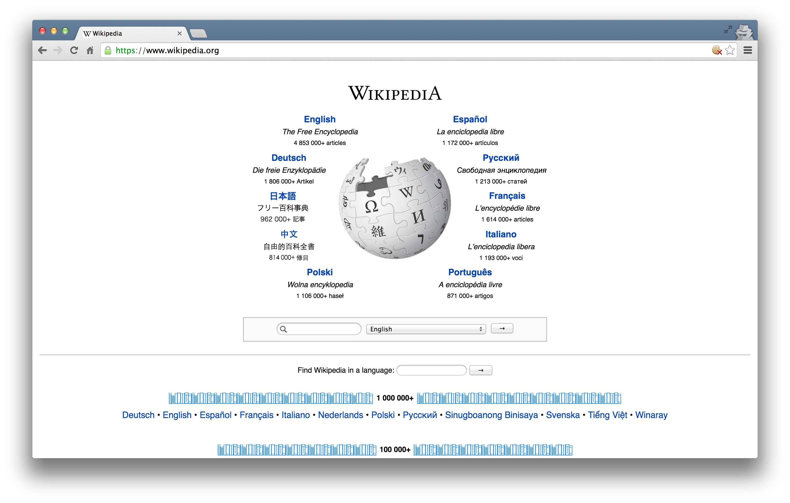

### Accessing Data: Some Preliminary Considerations

Whenever you're trying to get information from the web, it's very important to first know whether you're accessing it through appropriate means.

The UC Berkeley library has some excellent resources on this topic. Here is a flowchart that can help guide your course of action.


You can see the library's licensed sources [here](http://guides.lib.berkeley.edu/text-mining).

## What is an API?

* API stands for **Application Programming Interface**

* Broadly defined: a set of rules and procedures that facilitate interactions between computers and their applications

* A very common type of API is the Web API, which (among other things) allows users to query a remote database over the internet

* Web APIs take on a variety of formats, but the vast majority adhere to a particular style known as **Representational State Transfer** or **REST**

* What makes these "RESTful" APIs so convenient is that we can use them to query databases using URLs 

### RESTful Web APIs are All Around You...

Consider a simple Google search:


Ever wonder what all that extra stuff in the address bar was all about?  In this case, the full address is Google's way of sending a query to its databases asking requesting information related to the search term "golden state warriors". 


In fact, it looks like Google makes its query by taking the search terms, separating each of them with a "+", and appending them to the link "https://www.google.com/#q=".  Therefore, we should be able to actually change our Google search by adding some terms to the URL and following the general format...  


Learning how to use RESTful APIs is all about learning how to format these URLs so that you can get the response you want.

### Some Basic Terminology

* **Uniform Resource Location (URL)**: a string of characters that, when interpreted via the Hypertext Transfer Protocol (HTTP), points to a data resource, notably files written in Hypertext Markup Language (HTML) or a subset of a database.  This is often referred to as a "call".

* **HTTP Methods/Verbs**:

    + *GET*: requests a representation of a data resource corresponding to a particular URL.  The process of executing the GET method is often referred to as a "GET request" and is the main method used for querying RESTful databases.
    
    + *HEAD*, *POST*, *PUT*, *DELETE*: other common methods, though mostly never used for database querying.
    
### How Do GET Requests Work?  A Web Browsing Example

As you might suspect from the example above, surfing the web is basically equivalent to sending a bunch of GET requests to different servers and asking for different files written in HTML.

Suppose, for instance, I wanted to look something up on Wikipedia.  My first step would be to open my web browser and type in http://www.wikipedia.org.  Once I hit return, I'd see the page below.  



Several different processes occured, however, between me hitting "return" and the page finally being rendered.  In order:

1. The web browser took the entered character string and used the command-line tool "Curl" to write a properly formatted HTTP GET request and submitted it to the server that hosts the Wikipedia homepage.

2. After receiving this request, the server sent an HTTP response, from which Curl extracted the HTML code for the page (partially shown below).

3. The raw HTML code was parsed and then executed by the web browser, rendering the page as seen in the window.

```
[1] "<!DOCTYPE html>\n<html lang=\"mul\" dir=\"ltr\">\n<head>\n<!-- Sysops: Please do not edit the main template directly; update /temp and synchronise. -->\n<meta charset=\"utf-8\">\n<title>Wikipedia</title>\n<!--[if lt IE 7]><meta http-equiv=\"imagetoolbar\" content=\"no\"><![endif]-->\n<meta name=\"viewport\" content=\"i"
```

### Web Browsing as a Template for RESTful Database Querying

The process of web browsing described above is a close analogue for the process of database querying via RESTful APIs, with only a few adjustments:

1. While the Curl tool will still be used to send HTML GET requests to the servers hosting our databases of interest, the character string that we supply to Curl must be constructed so that the resulting request can be interpreted and succesfully acted upon by the server.  In particular, it is likely that the character string must encode **search terms and/or filtering parameters**, as well as one or more **authentication codes**.  While the terms are often similar across APIs, most are API-specific.

2. Unlike with web browsing, the content of the server's response that is extracted by Curl is unlikely to be HTML code.  Rather, it will likely be **raw text response that can be parsed into one of a few file formats commonly used for data storage**.  The usual suspects include .csv, .xml, and .json files.

3. Whereas the web browser capably parsed and executed the HTML code, **one or more facilities in R, Python, or other programming languages will be necessary for parsing the server response and converting it into a format for local storage** (e.g. matrices, dataframes, databases, lists, etc.).


### API Examples

- [**Twitter**](https://developer.twitter.com/) 
Used for pulling/streaming twitter data, posting status updates, and more. Check out their academic API.

- [**Spotify**](https://developer.spotify.com/)
Access to rich song data data such as valence, energy, and danceability metrics.

-  [**Watson IBM Natural Language Inference API**](https://cloud.ibm.com/apidocs/natural-language-understanding)
Use state of the art NLP models to analyze text sentiment, extract named entities, and classify text.


## NYT API

### All the News That's Fit to Query

The API that we've chosen for our lesson comes from the New York Times. They offer a treasure trove of data about their articles that is easily accessible and available for free!

In this section of the lesson we are going to 

    1. Sign up for developer/API keys — basically a passcode to access the NYT servers.
    2. Learn about what the NYT has to offer in terms of data.
    2. Install a 3rd-party Python package called [pynytimes](https://github.com/michadenheijer/pynytimes) which makes it incredibly to make API calls.
    3. Initialize a connection to their servers using the pynytimes and our keys.
    4. Make some calls on several of their APIs, parse the resulting data, and conduct some light data analysis on it.

[NYT Developer Page](http://developer.nytimes.com/)


## Getting API Access

For most APIs, a key or other user credentials are required for any database querying.  Generally, this requires that you register with the organization.  Most APIs are set up for developers, so you'll likely be asked to register an "application".  All this really entails is coming up with a name for your app/bot/project, and providing your real name, organization, and email.  Note that some more popular APIs (e.g. Twitter, Facebook) will require additional information, such as a web address or mobile number.

Once you've successfully registered, you will be assigned one or more keys, tokens, or other credentials that must be supplied to the server as part of any API call you make.  To make sure that users aren't abusing their data access privileges (e.g. by making many rapid queries), each set of keys will be given several **rate limits** governing the total number of calls that can be made over certain intervals of time.  For the NYT Article API, we have relatively generous rate limits --- 10 calls per minute and 4,000 calls per day.

[NYT Article API Keys](http://developer.nytimes.com/signup)


    1. Sign up for a new developer account with your email.
    
    2. Login with your new username and password.
    
    3. Click on your email in the top right corner and you'll see a dropdown menu that says **Apps**
    
    4. Click on **Apps** and then click on the **+ New App** button.
    
    5. You'll see the page where you'll be prompted to add a name for your App — you can call it anything. Then click enable on the APIs that are enabled in the screenshot. You can enable them all but make sure you at least enable the ones on the screenshot. 
    

  
    6. Once that is done you'll see your app with an api key, you're going to copy and paste that key into the API_workbook notebook.
    


Now we're ready to proceed to the API_workbook notebook and make some calls!
